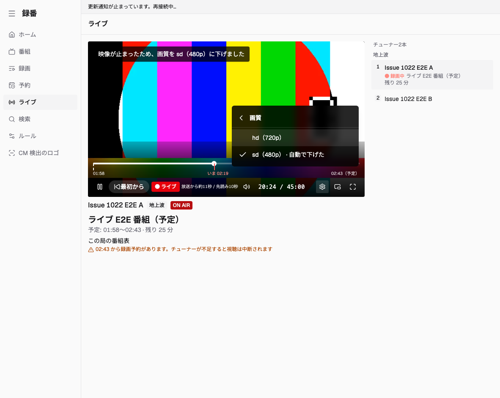
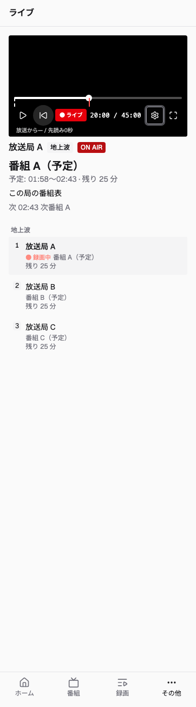

# Issue #1022 visual evidence

The screenshots below use the agreed [desktop](https://raw.githubusercontent.com/fetburner/rokuban/47c4744aed38d40c494d235b98f27600416ec296/mocks/live/1-desktop.png) and [phone](https://raw.githubusercontent.com/fetburner/rokuban/47c4744aed38d40c494d235b98f27600416ec296/mocks/live/2-phone.png) roughs from the [issue comment](https://github.com/fetburner/rokuban/issues/1022#issuecomment-5934493351). The desktop rough shows the settings menu and automatic downgrade notice; the phone rough shows the player controls.

## Desktop

Viewport: 1182 × 942 CSS pixels. The player, program axis, quality submenu, and downgrade notice are visible together. This capture was taken during the five-second notice after E2E switched from `hd` to `sd`.

| Agreed rough | Implemented screen |
| --- | --- |
|  |  |

## Phone

Viewport: 362 × 1299 CSS pixels. The settings menu is closed. The screenshot shows the program axis above the control row, followed by selected-channel details and the channel list.

| Agreed rough | Implemented screen |
| --- | --- |
|  |  |

## Differences in the captures

- The desktop uses an ffmpeg test pattern. The phone stub has no decodable video, so its player is black.
- Latency and buffer readings come from those fixtures. The screenshots verify controls and layout, not broadcast quality or tuner use.
- The loopback service stub has two channels; the rough lists more. Channel names and program times are seeded data. The displayed clock is dynamic.
- Capture data includes two tuners and an upcoming reservation. The tuner component reports the total available count. The rough shows per-band use.
- The phone time stays readable at this viewport. Diagnostics appear below the control row. The rough omits them on phone, while the requirement keeps them available beside the live indicator.
