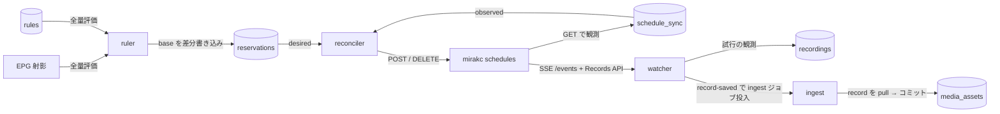

# 録画エンジン: mirakc への委譲と予約同期（索引）

録画の実行は [mirakc](https://github.com/mirakc/mirakc) に全面的に委譲する。Rokuban はルールエンジンと予約の宣言的同期に徹する。

**本文は `docs/recording/` に分割してある。節番号は分割前のまま**なので、コードコメントの「recording.md §3.2」等はこの表で該当ファイルを引ける。

## データフロー

## 節 → ファイル

| 節 | 内容 | ファイル |
|---|---|---|
| §1 | 方針: mirakc への全面委譲 / **例外の境界**（PSI 読み取りをどこまで許すか） | [recording/delegation.md](recording/delegation.md) |
| §2 | mirakc に任せること（schedule API / チューナー調停 / PSI 追従 / Records API / SSE 再送） | [recording/delegation.md](recording/delegation.md) |
| §3 §3.1 | **ruler**（ルール評価 → 予約生成）: 全量評価 + 差分書き込み / 複数ルール解決 / 重複排除 / サイトの扱い | [recording/ruler.md](recording/ruler.md) |
| §3.2 | **reconciler**（宣言的同期）: tags 対応付け / 予約オプションの差分反映 / 再作成のガード・レート制限 | [recording/reconciler.md](recording/reconciler.md) |
| §3.2 | **ファイル名テンプレート**（`filenameTemplate` の記法 / 使えるフィールド / サニタイズ / 検証） | [recording/contentpath.md](recording/contentpath.md) |
| §3.2 | **大量削除サーキットブレーカー**（ラッチ / 全損ガード / 再開 API / GC は対象外） | [recording/breaker.md](recording/breaker.md) |
| §3.2 | **番組終了後の GC**（実装は ruler の 1 パス内 `runGC`） | [recording/ruler.md](recording/ruler.md) |
| §3.3 | **watcher**（SSE 購読・状態反映）: 3 段構えの信頼性設計 / record 処理の冪等性 / 品質メタデータ / 開始遅延検出器 | [recording/watcher.md](recording/watcher.md) |
| §4 | **予約モデル: base / overrides 分離** —— `program_intents` と `program_overrides` / 予約オプション一覧 / jsonb を許す条件 / detached のライフサイクル / manual 予約との統一 / 録画開始後の編集 | [recording/reservation-model.md](recording/reservation-model.md) |
| §5 §6 | **ingest パイプライン**（転送方式 / インライン TS ドロップスキャン / リトライ設計 3 層 / worker）と **B-CAS 復号の責務境界** | [recording/ingest.md](recording/ingest.md) |
| §7 §8 §9 | mirakc schedule options / 録画品質の実測 / 落とした機能・スコープ外 | [recording/reference.md](recording/reference.md) |

読む順の目安:

- **ruler を触る** → §3.1 と §4（予約モデル）。削除まわりは [recording/breaker.md](recording/breaker.md) も
- **reconciler を触る** → §3.2（[reconciler.md](recording/reconciler.md) を軸に、ファイル名なら [contentpath.md](recording/contentpath.md)、削除の安全弁なら [breaker.md](recording/breaker.md)）と §7（schedule options）
- **watcher を触る** → §3.3
- **ingest / tsstat を触る** → §1 の「例外の境界」と §5・§6
- **予約 API を触る** → §4

## 用語

分割本文で定義済みの用語の早見表。定義の権威は「正典」列の節。

| 用語 | 定義 | 正典 |
|---|---|---|
| ruler | 「ルール x EPG」を全量評価して `reservations` の base を生成・更新するループ | §3.1 [ruler.md](recording/ruler.md) |
| reconciler | `reservations`（desired）と `schedule_sync`（observed）の差分を mirakc への POST/DELETE で消す宣言的同期ループ | §3.2 [reconciler.md](recording/reconciler.md) |
| watcher | mirakc の `/events` SSE を購読し、record の状態を `recordings` に反映して ingest を投入する | §3.3 [watcher.md](recording/watcher.md) |
| ingest | 録画完了後に record を HTTP pull してアーカイブへコミットする処理（インライン TS ドロップスキャン込み） | §5 [ingest.md](recording/ingest.md) |
| streamer | ライブ視聴（mirakc → ffmpeg → HLS）を担うロール。録画エンジンの外 | [overview.md](overview.md) / [api.md](api.md) |
| site | mirakc インスタンスの識別子。DB 全テーブルの `site` 列と API パス `/api/sites/{site}/...` に現れる | [configuration.md](configuration.md) |
| base | ruler が「ルール x EPG」から計算するフィールド群。`reservations.base` に載り、ruler だけが書く | §4.2 [reservation-model.md](recording/reservation-model.md) |
| overrides | ユーザーが上書きしたフィールドのみを持つ疎な jsonb。`program_overrides` 表に載り、api だけが書く | §4.2 同上 |
| effective | base + overrides。mirakc に同期され ingest/encode が参照するのは常にこれ | §4.2 同上 |
| desired | あるべき schedule の集合。`reservations` が表す | §3.2 [reconciler.md](recording/reconciler.md) |
| observed | mirakc から観測した現状（`GET /api/recording/schedules` の結果 = `schedule_sync`） | §3.2 同上 |
| orphaned（導出値） | 番組終了後に schedule が観測されなかった予約。`never_scheduled_events` の欠測行があり、本物の `recordings` 行が無いときに導出する | §4.3 / [schema.md](schema.md) §3 |
| active / detached（導出値） | `(rule_id, base)` から読むたびに導出。detached = かつてのルールが凍結した base で実質 manual | §4.3 §4.4 |

> 関連ドキュメント: [overview.md](overview.md)（全体アーキテクチャ）/ [data.md](data.md)（データ層）/ [schema.md](schema.md)（スキーマ）/ [storage.md](storage.md)（メディアストレージ）/ [operations.md](operations.md)（運用）
