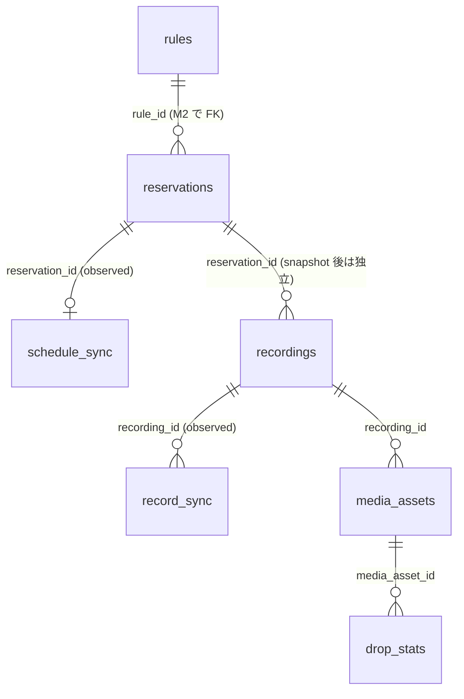

# データベーススキーマ v1

M1-2（issue #13）の成果物。設計根拠は issue #2（base/overrides 分離）、#3（desired/observed 分離・EPG プロジェクション）、#4（削除エンジン・保持ポリシー）、および [データ層](data.md)・[メディアストレージ](storage.md)。

**このスキーマは最終形で切る**（#6 の注意事項）。M1 で使わない列（エンコードプロファイル、保持ポリシー等）も、後続マイルストーンでのスキーマ churn を避けるため v1 に含める。

## 1. 設計原則

1. **desired / observed の分離**（k8s の spec/status と同型）
   - desired: `reservations`（ruler / api が書く「あるべき姿」）
   - observed: `schedule_sync` / `record_sync`（mirakc の観測結果。短命・使い捨て）
   - reconciler / watcher はこの 2 つの差分だけを見る
2. **mirakc 固有概念の隔離**（不変条件 7）
   - mirakc の形をしてよいのは短命な導出状態（`reservations` の base、`schedule_sync`、`record_sync`）だけ
   - 永続テーブル（`recordings` / `media_assets` / `drop_stats`）に mirakc の ID や enum を**構造として**持ち込まない。mirakc の record id は `record_sync` にのみ存在し、`record_sync.recording_id` が永続側への片方向ポインタになる
   - 例外: 品質イベント（`recording.failed` の理由等）は履歴として価値があるため、**構造化カラムではなく jsonb の自由形式ログ**として保持する（システムのロジックはその中身に依存しない）
3. **コミット = DB 行**（不変条件 3）: ファイルの公開は `media_assets` 行の INSERT。rename のアトミック性に依存しない
4. **tombstone**: 物理削除後もメタデータ行は残す。ドロップ統計・録画履歴・重複排除は削除後も機能する
5. **サイトスコープ**: mirakc の programId / record id はインスタンス単位のスコープしか持たない。[設定](configuration.md)（issue #9）は「多拠点が現実化したら `mirakcs:` リストで互換拡張」と定めており、その際のスキーマ波及を避けるため **mirakc を指すすべてのテーブルに `site` 列を最初から持つ**
   - `site` は設定ファイルで定義するサイト名（text）。サイトのレジストリは設定であり、DB に sites テーブルは作らない
   - M1 では設定が単一 `mirakc:` なので全行が同一サイト名になる。`mirakcs:` リスト対応は設定とアプリの変更のみで、マイグレーション不要
   - site を持つのは reservations / schedule_sync / record_sync / recordings（+ M1-6 の EPG プロジェクション）。media_assets / drop_stats は中央ストレージの台帳なので持たない
6. **型の規律**
   - 状態は Postgres の enum 型ではなく `text` + `CHECK`（enum 型はマイグレーションが面倒で利点が薄い）
   - 時刻はすべて `timestamptz`
   - ID は `bigint GENERATED ALWAYS AS IDENTITY`
   - クエリ軸（WHERE / JOIN に使う列）は型付きカラム、可変・詳細ペイロードは `jsonb`
   - **PostgreSQL 15 以上**を前提とする（`UNIQUE NULLS NOT DISTINCT` が 15 で導入）

## 2. 全体図



- 左側（rules / reservations）= desired、右上（*_sync）= observed、右下（recordings / media_assets / drop_stats）= 永続資産
- `rules` は M2（ruler）で追加。v1 では `rule_id` カラムだけ確保し FK 制約は M2 のマイグレーションで付ける
- EPG プロジェクション（`epg_services` / `epg_programs`）は M1-6 で追加（§9）

## 3. reservations — 予約（desired state）

ルール評価の純粋な出力。手動予約も同じテーブルで `source` が違うだけ。**M1 では ruler が存在しないため全行が manual（base は NULL、全フィールドが overrides）**。

```sql
CREATE TABLE reservations (
    id                bigint GENERATED ALWAYS AS IDENTITY PRIMARY KEY,
    site              text   NOT NULL,          -- 設定ファイル定義のサイト名
    program_id        bigint NOT NULL,          -- mirakc/Mirakurun の programId（site 単位のスコープ）
    source            text   NOT NULL CHECK (source IN ('rule', 'manual')),
    rule_id           bigint,                   -- M2 で REFERENCES rules(id) を追加
    state             text   NOT NULL DEFAULT 'active'
                             CHECK (state IN ('active', 'detached', 'orphaned')),

    -- 予約オプションの導出側（issue #2 の base/overrides コメント）。
    -- ユーザーの上書きは program_intents 表にあり、この行には載らない（§3.5）
    base              jsonb,                    -- ruler だけが書く。manual では NULL

    -- 番組情報の非正規化（reconciler の contentPath 生成・GC 判定・UI 表示を
    -- EPG プロジェクションの刈り取りと独立させるための最小限のスナップショット）
    title             text   NOT NULL DEFAULT '',
    program_start_at  timestamptz NOT NULL,
    program_duration_ms bigint NOT NULL,

    created_at        timestamptz NOT NULL DEFAULT now(),
    updated_at        timestamptz NOT NULL DEFAULT now(),

    UNIQUE (site, program_id)   -- desired 予約は site x programId につき最大 1 つ。detached にも適用
);

CREATE INDEX ON reservations (state);
CREATE INDEX ON reservations (rule_id);
```

- 同一の BS/CS 番組が複数サイトの EPG に現れた場合、site が違えば別予約になる（両サイトで録る、が表現可能）。サイト横断の重複排除はルール側の関心事（M2 の履歴ベース重複排除で扱う）

### base / overrides の意味論

- **effective = COALESCE(base, '{}') ⊕ program_intents.overrides**。reconciler が mirakc へ同期し、ingest / encode が参照するのは常に effective。解決は `db.EffectiveOptions` の 1 箇所に集約し、jsonb の Unmarshal 失敗を握りつぶさない
- base と overrides は**同形の jsonb ドキュメント**（§8）。ruler は EPG 更新のたびに base を丸ごと再計算してよく、**overrides は別表なので構造的に触れない**
- **`skip` は overrides のキーではなく `program_intents.action`**。列なので base 側の skip に対する優先順位が明示的に決まる（`action = 'skip'` が勝つ）。skip された番組は**予約行を持たない**

### state のライフサイクル

| state | 意味 | 遷移 |
|---|---|---|
| `active` | 通常の desired 予約 | — |
| `detached` | ルールがマッチしなくなったが overrides がある行。base は凍結され、実質 manual として動く（skip 付きなら録画しない detached） | ルール再マッチで base 再計算のうえ `active` に戻る（overrides は無傷） |
| `orphaned` | programId が EPG から消えた行。即削除せず猶予を置く（EPG フリッカー対策、issue #2） | EPG 復活で `active` へ。番組終了時刻経過で GC |

- **行の物理削除（GC）は「番組の終了時刻を過ぎた後」のみ**。`program_start_at + program_duration_ms` で判定できるため EPG テーブルに依存しない
- overrides のない active 予約がルール・EPG から消えた場合は通常の宣言的動作として削除（ただし大量削除サーキットブレーカーの対象）

### 書き込み所有権

| カラム | 書く人 |
|---|---|
| base, state（active/detached 遷移） | ruler（M2〜） |
| overrides、手動予約の作成・削除 | api |
| state（orphaned 遷移）、GC | reconciler / ruler の reconcile パス |

## 3.5 program_intents — 番組単位のユーザー意図（永続）

**api だけが書き、ruler は読むだけ**の表。予約（導出）とユーザー意図（永続）を分離する（issue #18 の案 A、[録画エンジン](recording.md) §4.2）。

```sql
CREATE TABLE program_intents (
    site       text   NOT NULL,
    program_id bigint NOT NULL,
    action     text   NOT NULL CHECK (action IN ('record', 'skip')),
    overrides  jsonb  NOT NULL DEFAULT '{}',   -- 上書きしたキーのみの疎なドキュメント
    -- GC 用スナップショット（EPG 射影の刈り取りと独立させる）
    program_start_at    timestamptz NOT NULL,
    program_duration_ms bigint      NOT NULL,
    created_at timestamptz NOT NULL DEFAULT now(),
    updated_at timestamptz NOT NULL DEFAULT now(),
    PRIMARY KEY (site, program_id)
);

CREATE INDEX ON program_intents (program_start_at);
```

- **`action`**: `record`（録れ = 手動予約 / ルール由来予約への上書き）/ `skip`（録るな = 番組単位の除外）。**skip された番組は `reservations` に行を持たない**
- **書き込み所有権**: api のみ。ruler は base を再計算するだけでこの表に触らない → 手動編集が構造的に上書きされない
- **GC**: 番組終了後（`program_start_at + duration < now()`）。意図の寿命を放送の寿命に揃える
- **site スコープ**: 「サイト A では録らない、B では録る」が N 予約の下では意味を持つため（[録画エンジン](recording.md) §3.1）
- SSE ヒントは `reservations` トピックに寄せる（意図の変更は予約一覧・番組表の両方に現れる）

取消は**無条件に `intent{skip}` を書いて導出行を落とす**。行を消すだけでは「消された行」と「最初から無かった行」が ruler から区別できず、次の全量パスが復活させる。

## 4. schedule_sync — mirakc schedule の観測（observed state）

`GET /api/recording/schedules` の全量取得結果をそのまま写像した使い捨てテーブル。reconciler だけが書く。**mirakc の形をしてよい唯一の予約側テーブル**。

```sql
CREATE TABLE schedule_sync (
    site           text   NOT NULL,
    program_id     bigint NOT NULL,             -- mirakc schedule のキー（site 単位のスコープ）
    reservation_id bigint REFERENCES reservations (id) ON DELETE SET NULL,
                                                -- tags の rokuban:reservation=<id> から解決。NULL = 外部産 schedule
    state          text   NOT NULL,             -- mirakc の状態をそのまま (scheduled/tracking/recording/…)
    options        jsonb  NOT NULL,             -- 観測された RecordingOptions そのまま
    tags           text[] NOT NULL DEFAULT '{}',
    failed_reason  jsonb,                       -- mirakc の FailedReason そのまま
    observed_at    timestamptz NOT NULL DEFAULT now(),
    PRIMARY KEY (site, program_id)
);

CREATE INDEX ON schedule_sync (reservation_id);
```

- 全量同期はサイト単位に、upsert + 「今回観測されなかった行の削除」を 1 トランザクションで行う（あるサイトへの疎通断が他サイトの観測を消さない）
- `reservation_id IS NULL` の行は Rokuban 以外が入れた schedule。reconciler は**触らない**（削除しない）
- mirakc の enum（state / failedReason）は text / jsonb のまま持ち、CHECK は付けない — mirakc 側の追加に追従するため

## 5. recordings — 録画履歴（永続資産）

**録画試行の永続履歴**。成功だけでなく失敗（`recording.failed`）も行として残す — 「録画品質の実測」（issue #2）と再放送待ち判断の入力になる。番組情報は mirakc record / schedule の program ペイロードから**非正規化スナップショット**し、EPG テーブルにも mirakc にも依存せず自己完結する。

```sql
CREATE TABLE recordings (
    id                bigint GENERATED ALWAYS AS IDENTITY PRIMARY KEY,
    reservation_id    bigint REFERENCES reservations (id) ON DELETE SET NULL,
    rule_id           bigint,        -- トレーサビリティ。M2 で FK 追加
    source            text   NOT NULL CHECK (source IN ('rule', 'manual')),
    site              text   NOT NULL,  -- どのサイトで録画したか（履歴として snapshot）

    -- 番組情報スナップショット（ARIB/ISDB の概念であり mirakc 固有ではない）
    network_id        integer NOT NULL,
    service_id        integer NOT NULL,
    event_id          integer NOT NULL,
    service_name      text    NOT NULL,
    channel_type      text    NOT NULL CHECK (channel_type IN ('GR', 'BS', 'CS', 'SKY')),
    channel           text    NOT NULL,
    title             text    NOT NULL DEFAULT '',
    description       text,
    extended          jsonb,                     -- 拡張形式イベント（出演者等）
    genres            jsonb,                     -- [{lv1, lv2, un1, un2}]
    is_free           boolean NOT NULL DEFAULT true,
    program_start_at  timestamptz NOT NULL,
    program_duration_ms bigint NOT NULL,

    -- 録画実行の結果
    status            text NOT NULL CHECK (status IN ('recording', 'finished', 'failed')),
    started_at        timestamptz,               -- 実際の録画開始（record の startTime）
    ended_at          timestamptz,

    -- 予約オプションの効力スナップショット（ingest / retention reconcile が参照）
    keep_original     text NOT NULL DEFAULT 'always'
                           CHECK (keep_original IN ('always', 'until_encoded')),
    encode_profiles   text[] NOT NULL DEFAULT '{}',   -- 設定ファイル定義のプロファイル名

    -- 品質イベントログ（recording.failed / record-broken の理由。§8 参照）
    -- mirakc の reason を jsonb のまま保持し、構造化カラムにはしない（不変条件 7）
    quality_events    jsonb NOT NULL DEFAULT '[]',

    -- ごみ箱（録画単位の論理削除。原本 + 派生物 + サムネイルのグループごと）
    deleted_at        timestamptz,

    created_at        timestamptz NOT NULL DEFAULT now(),
    updated_at        timestamptz NOT NULL DEFAULT now()
);

CREATE INDEX ON recordings (reservation_id);
CREATE INDEX ON recordings (program_start_at DESC);        -- ライブラリ一覧
CREATE INDEX ON recordings (network_id, service_id, event_id);
CREATE INDEX ON recordings (deleted_at) WHERE deleted_at IS NOT NULL;  -- ごみ箱ビュー
-- 履歴ベース重複排除（M2+）用: CREATE INDEX ON recordings USING gin (title gin_trgm_ops);
```

### 行の作られ方

- watcher が mirakc record を初観測（SSE または全量突き合わせ）→ record の program / service ペイロードからスナップショットして INSERT、`record_sync` 行から参照
- `recording.failed` で record が存在しないケース（start-recording-failed 等）→ status = `failed` の行を作り quality_events に理由を記録。**録画されなかった試行も履歴に残る**
- ingest の完了は recordings の status ではなく **`media_assets` 行の有無**で表現する（コミット = DB 行。冗長な状態カラムを持たない）

### ごみ箱（issue #4 の削除エンジンコメント)

- UI の削除 = `deleted_at` を立てるだけ。ファイルには触れない。復元 = `deleted_at` を消すだけ
- 物理削除は削除 reconcile ループが `deleted_at + 猶予期間（既定 30 日）` 経過後にアセット単位で実行（§6）
- 物理削除後も recordings 行と media_assets の tombstone は残る → ごみ箱を空にしても録画履歴・ドロップ統計・重複排除は壊れない

## 6. media_assets — メディアアセット（永続資産）

録画に紐づくファイルの台帳。**この行の存在が「公開済み」の定義**（ストレージ契約ルール 3）。

```sql
CREATE TABLE media_assets (
    id           bigint GENERATED ALWAYS AS IDENTITY PRIMARY KEY,
    recording_id bigint NOT NULL REFERENCES recordings (id),
    kind         text   NOT NULL CHECK (kind IN ('original', 'encoded', 'thumbnail')),
    profile      text,                -- kind = 'encoded' のみ: エンコードプロファイル名
    CHECK ((kind = 'encoded') = (profile IS NOT NULL)),
    rel_path     text   NOT NULL,     -- ストレージルートからの相対パス（不変条件: 絶対パス禁止）
    size_bytes   bigint NOT NULL,

    -- 物理削除プロトコル: active → deleting → deleted（冪等。どこで落ちても reconcile が拾い直す）
    state        text NOT NULL DEFAULT 'active'
                      CHECK (state IN ('active', 'deleting', 'deleted')),
    deleted_at   timestamptz,         -- 物理削除の完了時刻（tombstone）

    created_at   timestamptz NOT NULL DEFAULT now(),
    updated_at   timestamptz NOT NULL DEFAULT now(),

    -- 1 録画につき original / thumbnail は 1 つ、encoded はプロファイルごとに 1 つ
    UNIQUE NULLS NOT DISTINCT (recording_id, kind, profile)
);

CREATE INDEX ON media_assets (recording_id);
CREATE INDEX ON media_assets (kind, state);
-- 生きているアセットのパス衝突を防ぐ（tombstone のパスは再利用可）
CREATE UNIQUE INDEX ON media_assets (rel_path) WHERE state <> 'deleted';
```

- INSERT するのは worker（ingest / encode / thumbnail ジョブ）のみ。`ON CONFLICT` で冪等に
- **deleted への遷移後も行は消さない**（tombstone）。`drop_stats` と元サイズは原本削除後も UI で見られる
- 物理削除に至る 3 ソース（ごみ箱の猶予超過 / `until_encoded` の派生物完備 / 孤児回収）はすべて 1 本の削除 reconcile ループに集約し、一括削除サーキットブレーカーをループ全体に 1 つかける（issue #4）

## 7. record_sync — mirakc record の観測（observed state）と drop_stats

### record_sync

`GET /api/recording/records` と SSE の観測結果。watcher だけが書く。**mirakc の record id はこのテーブルにしか存在しない** — 永続側（recordings）へは `recording_id` で片方向に指す。

```sql
CREATE TABLE record_sync (
    site           text   NOT NULL,
    record_id      text   NOT NULL,             -- mirakc の 32 桁 hex（site 単位のスコープ）
    recording_id   bigint REFERENCES recordings (id) ON DELETE SET NULL,  -- NULL = 外部産 record（触らない）
    program_id     bigint NOT NULL,
    status         text   NOT NULL,             -- mirakc の recordingStatus そのまま
    content_path   text,
    content_length bigint,
    tags           text[] NOT NULL DEFAULT '{}',
    failed_reason  jsonb,
    observed_at    timestamptz NOT NULL DEFAULT now(),
    PRIMARY KEY (site, record_id)
);

CREATE INDEX ON record_sync (recording_id);
CREATE INDEX ON record_sync (status);
```

- ingest ジョブは (site, record_id) をここから取る。ingest コミット → エッジ record 削除 → 次回同期で行が消える（リングバッファの写像）
- `recording_id IS NULL`（rokuban タグのない record）は ingest 対象外
- 「未 ingest record 総量」メトリクス（M1-9）はこのテーブルの集計。ingest のサイト単位同時実行キャップ（M1-5）も site 列で分割する

### drop_stats — PID 別ドロップ統計（永続資産）

ingest のインライン TS スキャン（188 バイト境界、読み取り専用）の結果。原本アセットに紐づき、**tombstone 化後も残る**。

```sql
CREATE TABLE drop_stats (
    media_asset_id bigint  NOT NULL REFERENCES media_assets (id),
    pid            integer NOT NULL,
    packets        bigint  NOT NULL,   -- 総パケット数
    drops          bigint  NOT NULL,   -- continuity counter 不連続
    errors         bigint  NOT NULL,   -- transport_error_indicator
    scrambled      bigint  NOT NULL,   -- scrambling_control ≠ 0（> 0 は B-CAS 系異常の別枠アラート）
    PRIMARY KEY (media_asset_id, pid)
);
```

- ingest ジョブが media_assets のコミットと同一トランザクションで一括 INSERT

## 8. jsonb ドキュメント形式

### 予約オプション（reservations.base / program_intents.overrides、同形）

キーは camelCase（Go の JSON 規約と揃える）。overrides は「ユーザーが上書きしたキーのみ」を持つ疎なドキュメント。

```jsonc
{
  "skip": false,                     // true なら mirakc schedule を作らない
  "priority": 1,                     // mirakc RecordingOptions.priority
  "contentPath": "2026/07/タイトル_20260723.m2ts",  // recording.basedir 相対。サニタイズ済み
  "encodeProfiles": ["h265-1080p"],  // 設定ファイル定義のプロファイル名（M2〜）
  "keepOriginal": "untilEncoded"     // "always" | "untilEncoded"
}
```

- M1 では ruler がないため base = NULL、manual 予約の全フィールドが `program_intents.overrides` に入る
- `skip` は overrides のキーではなく `program_intents.action` の列（§3.5）
- 検証はアプリ層（Go の struct へのマッピング）で行う。DB は形を強制しない
- **命名規則の境界**: jsonb 内は camelCase（Go/JSON 規約）、SQL カラムは snake_case。recordings へのスナップショット時にアプリ層が変換する（例: jsonb の `"keepOriginal": "untilEncoded"` → SQL の `keep_original = 'until_encoded'`）

### quality_events（recordings、append-only 配列）

```jsonc
[
  {
    "at": "2026-07-23T21:05:00+09:00",
    "event": "recording.failed",             // recording.failed | recording.record-broken
    "reason": { "type": "io-error", "message": "...", "osError": 28 }  // mirakc の payload そのまま
  }
]
```

### failed_reason（schedule_sync / record_sync）

mirakc の `FailedReason`（discriminated union）をそのまま格納。

## 9. epg_services / epg_programs — EPG プロジェクション（使い捨てキャッシュ）

M1-6 で追加（マイグレーション `00004_epg.sql`）。**真実は常に mirakc**であり、これは
レベルトリガーでいつでも全量再構築できる使い捨てキャッシュ。永続資産（reservations /
recordings / media_assets）とは寿命が違うためスキーマ v1 から分離している。

存在理由は不変条件「**api ロールは EPG を含むすべてのデータ読み取りを Postgres だけで
完結させる**」（issue #3）。api が mirakc に問い合わせるパスを作らないため、プロジェクションは
**プロダクトが画面に描画するものを全部持つ**（= UI 完全形）。逆に mirakc の運用状態
（生 EIT/SI、チューナー状態）は入れない。

```sql
CREATE TABLE epg_services (
    site                  text    NOT NULL,
    network_id            integer NOT NULL,
    service_id            integer NOT NULL,
    type                  integer NOT NULL,
    logo_id               integer NOT NULL,
    remote_control_key_id integer NOT NULL,
    name                  text    NOT NULL,
    channel_type          text    NOT NULL CHECK (channel_type IN ('GR', 'BS', 'CS', 'SKY')),
    channel               text    NOT NULL,
    has_logo_data         boolean NOT NULL DEFAULT false,
    observed_at           timestamptz NOT NULL DEFAULT now(),
    PRIMARY KEY (site, network_id, service_id)
);

CREATE TABLE epg_programs (
    site        text    NOT NULL,
    program_id  bigint  NOT NULL,
    network_id  integer NOT NULL,
    service_id  integer NOT NULL,
    event_id    integer NOT NULL,
    start_at    timestamptz NOT NULL,
    duration_ms bigint  NOT NULL,
    end_at      timestamptz NOT NULL,   -- start_at + duration_ms（同期時にアプリが計算）
    is_free     boolean NOT NULL DEFAULT true,
    name        text    NOT NULL DEFAULT '',
    description text    NOT NULL DEFAULT '',
    genre_lv1   smallint[] NOT NULL DEFAULT '{}',
    extended    jsonb,   -- 拡張形式イベント（出演者等）
    genres      jsonb,   -- lv1 / lv2 / un1 / un2 の全量
    video       jsonb,   -- 映像属性
    audios      jsonb,   -- 音声属性
    observed_at timestamptz NOT NULL DEFAULT now(),
    PRIMARY KEY (site, program_id)
);
```

- **site を含むキーで切る**: 地上波のチャンネル構成はサイトの地域ごとに異なる
- **クエリ軸は型付きカラム、詳細は jsonb**: サービス / 時間範囲 / ジャンル / 無料が型付き。
  `genre_lv1` は絞り込み用に lv1 だけを重複なく取り出した配列（GIN）で、詳細は `genres` jsonb 側
- **`end_at` は生成列にしない**: `timestamptz + interval` が STABLE（TimeZone 設定に依存）で
  IMMUTABLE を要求する生成列に使えないため、同期時にアプリが計算して書く
- **pg_trgm GIN** を `name` / `description` に張る。LIKE だけでなく正規表現マッチ（`~`）も
  加速するので、M2 の ruler が同じインデックスに乗る（issue #3）
- **autovacuum を既定より積極的に**: 全量 upsert を繰り返すため churn が大きい

### 同期と有界性

worker ロールの River 定期ジョブ `epg_sync`（既定 10 分間隔、専用キューで同時実行 1）が
`GET /api/services` と `GET /api/programs` を全量取得して upsert する。差分同期はしない。

1 パスで 2 種類の削除を行う:

| 削除 | 条件 | 意図 |
|---|---|---|
| stale スイープ | `observed_at < 基準時刻` | mirakc から消えた行（番組編成変更・サービス削除）を落とす |
| ローリングウィンドウ | `end_at < 基準時刻 - retention_grace`（既定 24h） | 放送済み番組を刈り取る。**永遠に太らない** |

削除で足を踏み外さないための規律が 3 つある。

- 基準時刻は**アプリのクロックではなく `SELECT now()` で DB から取る**。クロックスキューで
  基準時刻が全 `observed_at` より後になると、毎パスでプロジェクション全体を消して
  再投入する churn 事故になる
- **番組の stale スイープは物理チャンネル単位に絞る**。mirakc の EPG 収集
  （`jobs.update-schedules` = 1 回チューニングして `collect-eits --sids=<そのチャンネルの SID>`）は
  **物理チャンネルごと**に実行され、既定では 1 日 2 回・timeout 10 分。録画とのチューナー競合や
  timeout で 1 チャンネルだけ番組が返らないことがある。サイト単位でスイープすると
  そのチャンネルの番組表だけが消えるため、**今回番組を返したチャンネルに属するサービスの行しか
  削除しない**。対象チャンネルのサービスは番組 0 件のものも含める（マルチ編成が終わった
  サブサービスの古い行を消せるようにするため。サービス単位に絞ると残ってしまう）
- **mirakc が空を返したらスイープを見送る**。再起動直後は EPG を読み込み終えておらず
  空リストを返しうる。そのままスイープすると番組表が丸ごと消え、次の同期までの数分間
  UI が空になる。削除しなくても次のパスが収束させる（レベルトリガー）。
  大量削除の前で立ち止まる規律は reconciler のサーキットブレーカーと同じ（issue #11）

`epg_programs` に channel 列は持たないので、スイープは `(network_id, service_id)` で対象を指す。
クエリは `network_id` ごとに分けて呼ぶ（1 つの TS は 1 つの original_network_id を持つので
チャンネルより粗くならず、可変長の組を SQL に渡さずに済む）。

なお `observed_at` には**意図的にインデックスを張っていない**。この列は毎パスで全行が
更新されるため、インデックスがあると HOT update が一切効かなくなりブロートが悪化する。
スイープの seq scan より、更新経路を HOT に保つ方が churn の総量では有利。

投影できない行は捨てて同期は続行する（1 行で全体を落とさない）:

- `startAt` がない番組 — 時間軸に置けない
- **`name` がない番組** — サブサービスの影の行（後述）
- `channel_type` が GR/BS/CS/SKY 以外のサービス — CHECK 制約に載らない

### サブサービス: 番組は絞る、サービスは絞らない（issue #17）

地上波は 1 物理チャンネルが複数サービスに分かれる（ＮＨＫ総合１/２、ＲＮＣ西日本テレビ１/２/３ 等）。
マルチ編成でないとき、サブサービス側は**同じ eventId で `name` が null の影の行**として
返るため、1 番組が 2〜3 行に重複する。実測では 7139 件中 4459 件が影の行だった。

- **番組は `name` を持つ行だけ投影する**（7139 → 2680、62% 減）。#3 が挙げた唯一の実性能懸念
  である churn / autovacuum 追従に直接効く
- **サービスは全件投影する**。19 行で churn が無視でき、マルチ編成を持つサブサービス
  （ＮＨＫ総合２ の高校野球等）を隠せない。番組のない空列を隠すのは UI の関心事とし、
  「そのサービスに窓内の番組が 1 件でもあるか」で判定する

影の行を落としても録れなくなる番組はない。mirakc の録画は `filter-program --sid --eid` で
サービス単位に絞るため、影の行を予約しても得られるものは同じ shared グループの親と同じか空。
逆にマルチ編成の実番組は `name` を持つのでこのフィルタを通り、予約・録画できる。

EPGStation は `relatedItems` を見る `isMainProgram()` と name チェックの二段で同じことを
しているが、実データ 7139 件で「`name` があって shared の main でない番組」が 0 件だったため、
`name` の有無だけで同一の結果になる（`relatedItems` の移植は不要）。

予約・録画はこのテーブルに依存しない。予約の GC は `program_start_at + program_duration_ms`
で判定し（§3）、録画した番組情報は recordings に非正規化スナップショットされる（§5）。
だから刈り取りが永続資産を壊すことはない。

## 10. 後続マイグレーションで追加するテーブル

v1 には**含めない**が、参照関係を先に固定しておくもの:

| テーブル | マイルストーン | v1 との接続 |
|---|---|---|
| `rules` | M2 | `reservations.rule_id` / `recordings.rule_id` に FK 制約を追加 |
| `orphan_files` | 削除エンジン実装時 | 孤児候補の first_seen 記録（DB リストアで削除窓が開き直す安全弁） |
| サービスロゴ台帳 | M2+ | ファイルは `logos/` 配下、DB は相対パス + ハッシュ |
| `tuner_sync` | M2 | mirakc の `/api/tuners` の観測（使い捨てプロジェクション）。容量超過の判定に使う。`epg_services` と同型で、`types text[]` に `CHECK (types <@ ARRAY['GR','BS','CS','SKY'])` |
| `reservations` へのチャンネル列追加 | M2 | `network_id` / `service_id` / `channel_type` / `channel` のスナップショット。容量超過の判定は需要の単位が `(channel_type, channel)` なので必須。使い捨ての EPG 射影への JOIN に頼れない（[データ層](data.md) §6.5） |

EPG プロジェクションが v1 に入らなかった理由: 使い捨てキャッシュであり永続資産と寿命が違う（§9）。「最終形で切る」対象は、他の全タスクが依存し、後から変えると痛い**永続資産と desired/observed の骨格**。

## 11. 未決事項（実装前に issue で確定させる）

1. ~~複数ルールマッチのトレーサビリティ~~ → **確定（issue #3 のコメント）**: base 内の配列ではなく中間テーブル `reservation_rule_matches (reservation_id, rule_id)`。「このルールが今どの予約を生んでいるか」の逆引き（ルール削除の影響プレビュー）が要るため。ruler が毎パス書く導出状態なので FK は両側 ON DELETE CASCADE
2. **`record_sync.recording_id` の NOT NULL 化**: 現設計は外部産 record を NULL で表現する。外部産を track しない（行を作らない）選択肢もある
3. ~~drop_stats の PID 名~~ → issue #23 で設計中（M2。PAT → PMT の読み取り + component_tag）
4. ~~ルールとサイトの対応~~ → **確定（[録画エンジン](recording.md) §3.1「サイトの扱い」）**: ルールはサイトに従属せず、サイトは条件の一次元（`rule_sites` 子テーブル、指定なし = 全サイト）。実体化はマッチした全サイトで N 予約（複数録画 → ドロップ統計で選別する運用を一級とする）。サイト名は安定識別子でリネームは運用作業
