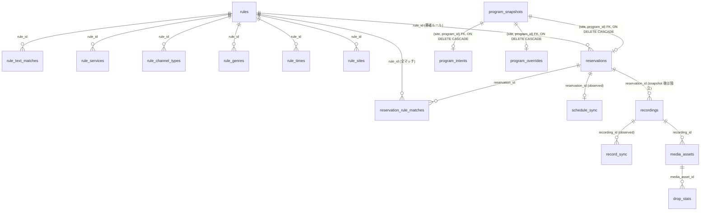

# データベーススキーマ v1（索引）

M1-2（issue #13）の成果物。設計根拠は issue #2（base/overrides 分離）、#3（desired/observed 分離・EPG プロジェクション）、#4（削除エンジン・保持ポリシー）、および [データ層](data.md)・[メディアストレージ](storage.md)。

**「最終形で切る」（#6 の注意事項）の対象は永続資産に限る。** M1 で使わない列（エンコードプロファイル、保持ポリシー等）も、後続マイルストーンでのスキーマ churn を避けるため v1 に含める —— ただしこれは `recordings` / `media_assets` / `drop_stats` / `rules` の話である。

> **M2 完了後の訂正。** 当初この方針を導出テーブルにも適用したが、逆効果だった。`reservations` は「churn を避けるため」に ruler / reconciler が存在しない時点で列を決めた結果、`00006` / `00008` / `00009` / `00012` / `00013` の**5 本で変更された**（`source` 削除・`overrides` を 2 回移設・チャンネル列追加・dedup 列追加）。一方、本当に最終形で切る価値がある永続資産はほぼ無傷である（変更は `pid_type` 追加 1 件）。
>
> churn のコストが非対称だからである。永続資産のマイグレーションはデータ移行を伴って危険だが、**導出テーブルは再構築できるので churn がほぼ無害**（`00008` / `00010` / `00012` はいずれも Down が片道であることを許容して通っている）。導出テーブル（`reservations` / `schedule_sync` / `record_sync` / 射影）の列は、**それを書くコードと同じ PR で決める**（[CLAUDE.md](../CLAUDE.md) 不変条件 11）。

**本文は `docs/schema/` に分割してある。節番号は分割前のまま**なので、コードコメントの「schema.md §3.5」等はこの表で該当ファイルを引ける。

| 節 | 内容 | ファイル |
|---|---|---|
| §1 | **設計原則**（desired/observed 分離 / mirakc 固有概念の隔離 / tombstone / サイトスコープ / 導出値と事実の分離 / 行の寿命 / 型の規律） | [schema/principles.md](schema/principles.md) |
| §3 §3.5 §3.6 §3.7 | **desired**: `reservations`（予約）/ `program_intents`・`program_overrides`（ユーザー意図）/ `circuit_breakers`（ブレーカーのラッチ）/ `program_snapshots`（番組の事実のスナップショット。Phase 1） | [schema/reservations.md](schema/reservations.md) |
| §4 | **observed**: `schedule_sync`（mirakc schedule の観測） | [schema/schedule-sync.md](schema/schedule-sync.md) |
| §5 §6 | **永続資産**: `recordings`（録画履歴）/ `media_assets`（メディアアセット台帳） | [schema/recordings.md](schema/recordings.md) |
| §7 | **observed**: `record_sync`（mirakc record の観測）と `drop_stats` | [schema/record-sync.md](schema/record-sync.md) |
| §8 | jsonb ドキュメント形式（base / overrides / quality_events の形） | [schema/jsonb.md](schema/jsonb.md) |
| §9 §9.5 | **使い捨てキャッシュ**: `epg_services` / `epg_programs`（EPG 射影）/ `tuner_sync`（チューナー射影） | [schema/projections.md](schema/projections.md) |
| §10 §11 | 後続マイグレーションで追加するテーブル / 未決事項 | [schema/future.md](schema/future.md) |

`rules` 一式（`rules` + 子テーブル 6 つ + `reservation_rule_matches`）は §10 とマイグレーション `00006_rules.sql` を参照。

## 2. 全体図

- **desired**: `rules` + 子表（ユーザーが書く永続資産）/ `program_intents` + `program_overrides`（番組単位のユーザー意図。永続）/ `reservations`（ruler が導出）
- **番組の事実のスナップショット**: `program_snapshots`（EPG プロジェクションから複製した、放送の寿命を持つキャッシュ。Phase 1。§3.7）
- **observed**: `schedule_sync` / `record_sync`（mirakc の観測。短命・使い捨て）
- **永続資産**: `recordings` / `media_assets` / `drop_stats`
- `program_intents` / `program_overrides` と `reservations` は互いに FK では対応しない。三者はいずれも共通の `(site, program_id)` で `program_snapshots` への FK（`ON DELETE CASCADE`）を持つことで結びつく（Phase 1）。**skip された番組は `reservations` に行を持たない**ため、常に 1:1 ではない（§3.5）
- `reservations.rule_id` は**勝者ルール**のみ。マッチした全ルールは `reservation_rule_matches` に入る
- `rules` 一式と `program_intents` は M2 で追加（`00006` / `00008`）、`program_overrides` は M2-4 で分離（`00010`）。EPG プロジェクション（`epg_services` / `epg_programs`）は M1-6（`00004`）、チャンネル列は `00009`。`program_snapshots` は Phase 1（`00017`）で追加され、同マイグレーションで `reservations.state` が `orphaned_at` に置き換わった

