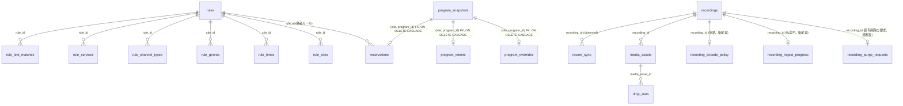

# データベーススキーマ v1（索引）

設計根拠は [データ層](data.md)・[メディアストレージ](storage.md)、および [invariants.md](invariants.md)。

**「最終形で切る」の対象は永続資産（`recordings` / `media_assets` / `drop_stats` / `rules`）に限る。** 導出テーブル（`reservations` / `*_sync` / 射影）の列は、それを書くコードと同じ PR で決める（不変条件 11。導出テーブルまで先に固めて churn を生んだ経緯は [invariants.md](invariants.md) §11）。

**本文は `docs/schema/` に分割してある。節番号は分割前のまま**なので、コードコメントの「schema.md §3.5」等はこの表で該当ファイルを引ける。

| 節 | 内容 | ファイル |
|---|---|---|
| §1 | **設計原則**（desired/observed 分離 / mirakc 固有概念の隔離 / tombstone / サイトスコープ / 導出値と事実の分離 / 行の寿命 / 型の規律） | [schema/principles.md](schema/principles.md) |
| §3 §3.5 §3.6 §3.7 | **desired**: `reservations`（予約）/ `program_intents`・`program_overrides`（ユーザー意図）/ `circuit_breakers`（ブレーカーのラッチ）/ `program_snapshots`（番組の事実のスナップショット。Phase 1） | [schema/reservations.md](schema/reservations.md) |
| §4 | **observed**: `schedule_sync`（mirakc schedule の観測） | [schema/schedule-sync.md](schema/schedule-sync.md) |
| §5 §6 | **永続資産**: `recordings`（録画履歴）/ `media_assets`（メディアアセット台帳）。`recording_encode_policy`（原本保持ポリシーの凍結）・`recording_ingest_progress`（転送の途中経過）・`recording_purge_requests`（即時完全削除の要求）の 3 つの衛星表も§5 内 | [schema/recordings.md](schema/recordings.md) |
| §7 | **observed**: `record_sync`（mirakc record の観測）と `drop_stats` | [schema/record-sync.md](schema/record-sync.md) |
| §8 | jsonb ドキュメント形式（base / overrides / quality_events の形） | [schema/jsonb.md](schema/jsonb.md) |
| §9 §9.5 | **使い捨てキャッシュ**: `epg_services` / `epg_programs`（EPG 射影）/ `tuner_sync`（チューナー射影） | [schema/projections.md](schema/projections.md) |
| — | **永続資産**: `rules` 一式（`rules` + 条件の子テーブル 6 つ） | [schema/rules.md](schema/rules.md) |
| §10 §11 | マイグレーションの権威の所在 / 未決事項 | [schema/future.md](schema/future.md) |

## 2. 全体図

- **desired**: `rules` + 子表（ユーザーが書く永続資産）/ `program_intents` + `program_overrides`（番組単位のユーザー意図。永続）/ `reservations`（ruler が導出）
- **番組の事実のスナップショット**: `program_snapshots`（EPG プロジェクションから複製した、放送の寿命を持つキャッシュ。Phase 1。§3.7）
- **observed**: `schedule_sync` / `record_sync`（mirakc の観測。短命・使い捨て）
- **永続資産**: `recordings` / `media_assets` / `drop_stats`。`recording_encode_policy` は `recordings` を指す衛星表（行の存在 = 凍結済み）。`recording_ingest_progress` も同じく衛星表で、行の存在 = 原本を転送中（コミットで消える）。`recording_purge_requests` も衛星表で、行の存在 = ごみ箱の猶予を待たない完全削除の要求（復元は DELETE）
- `program_intents` / `program_overrides` と `reservations` は互いに FK では対応しない。三者はいずれも共通の `(site, program_id)` で `program_snapshots` への FK（`ON DELETE CASCADE`）を持つことで結びつく（Phase 1）。**意図が skip で、かつ上書きが無い番組は `reservations` に行を持たない**（overrides があれば skip でも行は残る。detached として保持。§3.5）ため、常に 1:1 ではない
- `reservations.rule_id` が持つのは**勝者ルール**のみ。負けたルールは記録しない —— 勝者以外は `base` に何も供給しないので、削除も無効化も予約を変えない（[schema/rules.md](schema/rules.md)）。マイグレーションの一覧は `internal/db/migrations/` が権威

